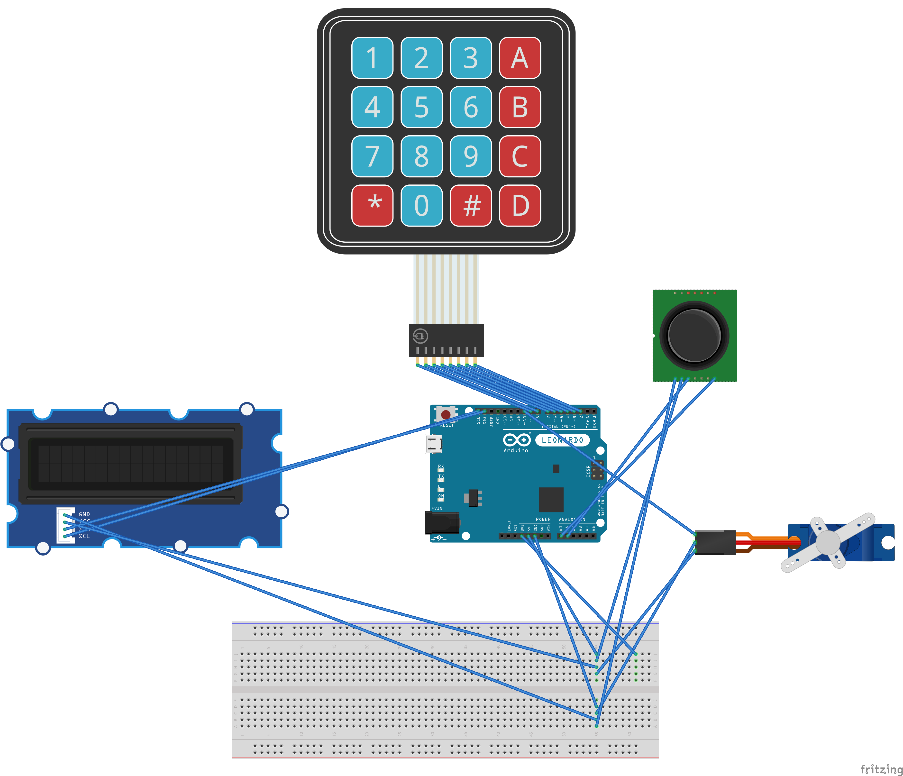

# Door-Locker

Projet Electronique Embarquée :  **Thomas MARTIN - Corentin DELAGE - Sandrine PATIN - Julien GUILLAN**

## Qu'est ce que c'est 

Ce projet a pour objectif de réaliser un système permettant de dévérrouiller une porte (dans notre cas représentée par un servomoteur) à l'aide d'un mot de passe composé de texte grâce au KeyPad et de mouvement de Joystick.

## Matériel utilisé

**Carte Arduino :** Arduino Mega

**Ecran LCD 1:** Grove LCD RGB

**Ecran LCD 2:** LCD 16x2

**Joystick :** Joystick GT1079

**KeyPad :** Membranska Tipkrovnica 4X4

**ServoMoteur :** Servo Motor TowerPro SG90

## Librairies utilisées

`LiquidCrystal by Arduino & Adafruit`--> Version **1.0.7**

`Keypad by Mark Stanley & Alexander Brevig`-->  Version **3.1.1**

`Grove -  LCD RGB Backlight by Steed Studio`--> Version **1.0.0**

`Servo by Michael Margolis & Arduino` --> Version **1.1.6**

## Déroulement du projet

Dans l'ensemble, le projet s'est correctement déroulé, nous avons rapidement réussi à faire fonctionner chaque élément indépendamment, les soucis ont débuté lorsqu'il a fallu tout rassembler et faire fonctionner l'ensemble. L'utilisation du KeyPad et du Joystick en simultané n'a pas posé de soucis , mais lorsque l'on y rajoutait l'écran , impossible de faire fonctionner le programme. 

Après avoir pensé à un soucis de compatibilité entre l'écran et un autre élément , nous avons remplacé l'écran , sans succès. Nous avons revu le code pour essayer d'y trouver le soucois , sans succès non plus. 

Finalement , le soucis à été résolu en remplaçant l'Arduino Leonardo prévue au départ, par une Arduino Mega. Nous pensons donc que le soucis venait d'une surchage de la pile , ou bien de conflit entre certains port de l'Arduino Leonardo.

